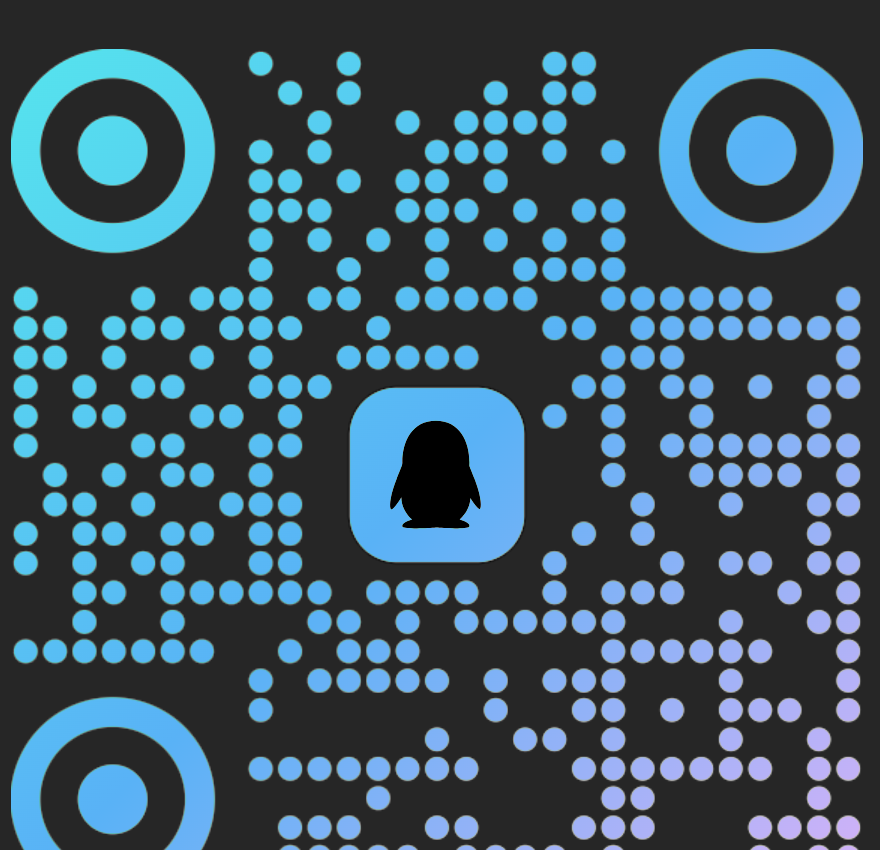

  <picture>
    <source media="(prefers-color-scheme: dark)" srcset="logo-dark.svg">
    
  </picture>

<h1 align="center">Moho Mate</h1>

[English](README.md) | 中文

**Moho 的 AI 伴侣。** 你专注动画，繁琐的事交给它——项目检查、Lua 脚本、批量渲染、社区脚本安装，一句话的事。macOS，Apple Silicon & Intel。

## 它能做什么

- 💬 **懂 Moho 的 AI 伴侣** —— 项目检查、临时 Lua、重复性的准备工作，聊着天就做完
- 🎞 **渲染与编码** —— 跟 AI 说一声就出片
- 📦 **[mohoscripts.com](https://mohoscripts.com)** —— 社区脚本包，跟 AI 说一声就装好

## 环境要求

- Moho Pro 14.4+
- 建议 macOS 12+（在 Monterey/Intel 上实测；提供 Apple Silicon 与 Intel 两种构建，其他版本未测）

## 安装（内测阶段）

1. 从 [Releases](https://github.com/defims/moho-mate/releases) 下载对应 DMG——`arm64` = Apple Silicon，`x64` = Intel
2. 打开 DMG，把 **moho-mate** 拖进 Applications
3. 首次打开：**右键点击 → 打开**（内测期未签名，直接双击会被 Gatekeeper 拦）
4. Moho Mate 在**屏幕顶部菜单栏**（🎬），没有 Dock 图标

## 激活

内测采用邀请制。向维护者索取内测码，打开**设置**粘贴后点**激活**。一码限 2 台设备，换机请找我换绑。

## 内测交流群

| 微信群 | QQ 群 |
|---|---|
|  |  |
| Moho Mate 内测群 | moho-mate 内测群（群号 `1012910951`） |

- 二维码 7 天有效（微信当前至 9 月 18 日），过期请喊管理员刷新；QQ 群也可直接搜索群号加入（长期有效）
- 安装、激活、使用问题欢迎群里提问

## 反馈

Bug 与建议 → [提交 Issue](https://github.com/defims/moho-mate/issues)，也欢迎加群反馈。请附：

- 版本号（设置页点击复制）
- 诊断 → 打包日志的 zip
- 复现步骤

> **隐私说明**：内测版激活后会自动上传诊断日志（仅限诊断信息），以便更快修复问题——如需排除请告知。

## 许可与第三方声明

第三方组件：

- **pi_agent_rust** — © 2026 Jeffrey Emanuel (Dicklesworthstone)。**MIT (with OpenAI/Anthropic Rider)**——标准 MIT 授予外加附加条款：不授予 OpenAI, L.L.C.、Anthropic, PBC 及其关联方任何权利。moho-mate 通过 path dependency 使用 [defims/picrab](https://github.com/defims/picrab) fork。
- **asupersync** —— 同作者、同许可体系（MIT with OpenAI/Anthropic Rider），pi_agent_rust 的传递依赖。
- **pi-web** —— © 2026 agegr (Federico Jaramillo Martinez)，MIT。moho-mate 使用 [defims/picrab-web](https://github.com/defims/picrab-web) fork。
